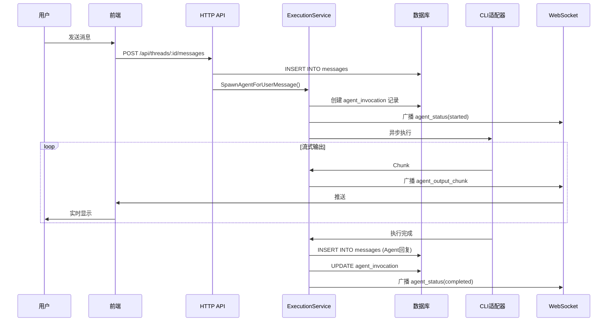
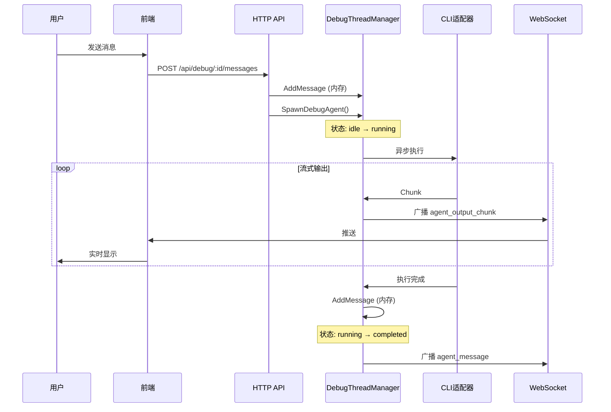

# Agent 调用链路与记忆机制分析

本文档分析 ISDP 平台中 Agent 的调用链路、屏幕显示机制以及记忆（上下文）构建方式。

## 一、Agent 调用的两条链路

ISDP 平台支持两种 Agent 执行模式，分别对应不同的使用场景和数据存储策略。

### 1. 工作流模式 (Workflow Mode)

**适用场景**: 正式的多Agent协作工作流，需要持久化存储

**数据流**:
```
用户消息 → ThreadService.CreateMessage()
         → Orchestrator.SpawnAgentForUserMessage()
         → ExecutionService.SpawnAgent()
         → 异步执行 executeAgent()
         → 适配器执行 (Claude CLI)
         → 结果持久化到 PostgreSQL/SQLite
```

**核心代码路径**:
```
isdp/internal/service/thread/service.go
  └─ SpawnAgentForUserMessage()  # 消息触发Agent

isdp/internal/service/agent/orchestrator.go
  └─ SpawnAgent() → ExecutionService
  └─ SpawnAgentForUserMessage()

isdp/internal/service/agent/execution_service.go
  └─ SpawnAgent()              # 创建调用记录
  └─ executeAgent()            # 异步执行
  └─ buildContextLayers()      # 构建四层上下文
  └─ saveAgentMessage()        # 持久化消息
```

**数据存储**:
- 消息存储在 `messages` 表
- Agent调用记录存储在 `agent_invocations` 表
- 支持历史查询和回放

### 2. 调试模式 (Debug Mode)

**适用场景**: 快速原型验证、临时测试、无需持久化

**数据流**:
```
用户消息 → DebugThreadManager (内存)
         → Orchestrator.SpawnDebugAgent()
         → executeDebugAgent() (goroutine)
         → 适配器执行
         → 结果存储在内存中
```

**核心代码路径**:
```
isdp/internal/service/agent/debug_thread_manager.go
  └─ CreateThread()           # 创建内存线程
  └─ AddMessage()             # 内存消息列表
  └─ BroadcastChunk()         # 实时流式输出

isdp/internal/service/agent/orchestrator.go
  └─ SpawnDebugAgent()        # 调试模式启动
  └─ executeDebugAgent()      # 异步执行
```

**数据存储**:
- 所有数据仅存在于内存 `map[uuid.UUID]*DebugThread`
- 线程最大存活 2 小时，自动清理
- 不写入数据库

## 二、屏幕显示链路

两种模式使用相同的 WebSocket 实时推送机制，但状态管理不同。

### 1. WebSocket 通信架构

```
后端 Agent 执行
       │
       ▼
  ws.Hub.BroadcastToThread()
       │
       ▼
  WebSocket 连接
       │
       ▼
  前端 onMessage 回调
       │
       ▼
  Zustand Store 更新
       │
       ▼
  React 组件渲染
```

### 2. 后端广播消息类型

| 消息类型 | 说明 | 触发时机 |
|---------|------|---------|
| `agent_status` | Agent 状态变更 | 启动、完成、失败 |
| `agent_output_chunk` | 流式输出块 | 执行过程中实时推送 |
| `agent_message` | 完整消息 | Agent 执行完成 |

**广播代码示例** (`execution_service.go`):
```go
// 广播状态
func (es *ExecutionService) broadcastStatus(threadID, invocationID uuid.UUID, status string, role model.AgentRole) {
    if es.wsHub != nil {
        es.wsHub.BroadcastToThread(threadID.String(), ws.WSMessage{
            Type: "agent_status",
            Payload: map[string]interface{}{
                "invocationId": invocationID.String(),
                "status":       status,
                "role":         string(role),
            },
        })
    }
}

// 广播流式输出
func (es *ExecutionService) broadcastChunk(threadID, invocationID uuid.UUID, chunk Chunk, agentID, agentName string) {
    es.wsHub.BroadcastToThread(threadID.String(), ws.WSMessage{
        Type: "agent_output_chunk",
        Payload: map[string]interface{}{
            "chunk":     chunk.Content,
            "agentId":   agentID,
            "agentName": agentName,
        },
    })
}
```

### 3. 前端状态管理

**工作流模式** (`useAppStore`):
```typescript
// web/src/stores/useAppStore.ts
interface AppState {
  messages: Message[];
  addMessage: (msg: Message) => void;
  updateStreamingMessage: (id: string, content: string) => void;
}
```

**调试模式** (`useDebugThreadStore`):
```typescript
// web/src/stores/useDebugThreadStore.ts
interface DebugThreadState {
  messages: DebugMessage[];
  streamingContent: string;
  status: 'idle' | 'running' | 'completed' | 'error';
  addMessage: (msg: DebugMessage) => void;
  appendStreamContent: (chunk: string) => void;
}
```

## 三、Agent 记忆机制

### 核心概念

**Agent 没有独立的"记忆存储"**。所谓的"记忆"是通过动态查询历史消息实现的。

### 四层上下文构建

每次 Agent 执行时，系统构建四层上下文：

```
┌─────────────────────────────────────────────────────────┐
│ Layer 0: System Prompt                                  │
│ - 来自 AgentRoleConfig.SystemPrompt                    │
│ - 定义 Agent 的角色、职责、能力边界                     │
└─────────────────────────────────────────────────────────┘
                          │
                          ▼
┌─────────────────────────────────────────────────────────┐
│ Layer 1: Thread History (对话历史)                      │
│ - 从 messages 表查询最近 50-100 条消息                  │
│ - 格式化为 "[角色] 内容" 形式                           │
│ - 这就是 Agent 的"记忆"                                 │
└─────────────────────────────────────────────────────────┘
                          │
                          ▼
┌─────────────────────────────────────────────────────────┐
│ Layer 2: Artifacts (工作产物)                           │
│ - Thread 关联的文档、代码等产物                         │
│ - 目前返回空，待实现                                    │
└─────────────────────────────────────────────────────────┘
                          │
                          ▼
┌─────────────────────────────────────────────────────────┐
│ Layer 3: Environment Info (环境信息)                    │
│ - Thread ID、当前阶段、状态等                           │
│ - 提供上下文环境信息                                    │
└─────────────────────────────────────────────────────────┘
```

### 上下文构建代码

**execution_service.go**:
```go
func (es *ExecutionService) buildContextLayers(ctx context.Context, threadID uuid.UUID, config *model.AgentRoleConfig) (*ContextLayers, error) {
    layers := &ContextLayers{}

    // Layer 0: 系统提示
    layers.Layer0 = config.SystemPrompt

    // Layer 1: Thread历史 - 这就是Agent的"记忆"
    messages, err := es.msgRepo.FindByThreadID(ctx, threadID, 100)
    if err != nil {
        return nil, err
    }
    layers.Layer1 = es.formatMessages(messages)

    // Layer 2: 工作产物
    thread, err := es.threadRepo.FindByID(ctx, threadID)
    if err != nil {
        return nil, err
    }
    layers.Layer2 = es.getArtifacts(thread)

    // Layer 3: 环境信息
    layers.Layer3 = es.getEnvironmentInfo(thread)

    return layers, nil
}
```

### 消息格式化

```go
func (es *ExecutionService) formatMessages(messages []*model.Message) string {
    var sb strings.Builder
    for _, msg := range messages {
        role := "用户"
        if msg.Role == model.MessageRoleAgent {
            role = msg.AgentID
        }
        sb.WriteString(fmt.Sprintf("[%s] %s\n", role, msg.Content))
    }
    return sb.String()
}
```

### 数据库查询

**message.go** repository:
```go
func (r *MessageRepository) FindByThreadID(ctx context.Context, threadID uuid.UUID, limit int) ([]*model.Message, error) {
    query := `SELECT id, thread_id, role, agent_id, content, message_type, metadata, created_at
              FROM messages
              WHERE thread_id = $1
              ORDER BY created_at ASC
              LIMIT $2`
    // 执行查询...
}
```

## 四、完整数据流图

### 工作流模式完整流程



### 调试模式完整流程



## 五、关键文件索引

| 文件 | 职责 |
|-----|------|
| `internal/service/agent/orchestrator.go` | Agent 编排器，协调两种模式 |
| `internal/service/agent/execution_service.go` | 工作流模式执行服务 |
| `internal/service/agent/debug_thread_manager.go` | 调试模式内存管理 |
| `internal/service/agent/claude_adapter.go` | Claude CLI 适配器 |
| `internal/repo/message.go` | 消息数据库操作 |
| `internal/ws/hub.go` | WebSocket 广播中心 |
| `web/src/stores/useAppStore.ts` | 工作流模式前端状态 |
| `web/src/stores/useDebugThreadStore.ts` | 调试模式前端状态 |

## 六、CLI 调用参数与记忆管理

### CLI 调用参数

ISDP 在调用 Claude CLI 时使用以下参数：

```go
args := []string{
    "--print",                        // 打印模式，输出到 stdout
    "--output-format", "stream-json", // 流式 JSON 输出格式
    "--verbose",                      // 详细输出
    "--permission-mode", "auto",      // 自动权限模式
    "--no-session-persistence",       // 禁用 CLI 会话持久化
}
```

### 为什么使用 `--no-session-persistence`

**问题背景**: Claude CLI 默认会将会话信息持久化到 `.claude/sessions/` 目录。如果使用 `--continue` 参数，CLI 会自动恢复上次会话。

**记忆干扰问题**:
- 当多个 Agent 在同一项目目录下执行时（相同 WorkDir）
- 每次调用都会读写同一个 `.claude/sessions/` 目录
- 导致不同 Agent 的"记忆"相互覆盖和干扰
- 例如：Agent A 的执行结果可能被 Agent B 的下次调用读取到

**解决方案**:
使用 `--no-session-persistence` 禁用 CLI 内部的会话持久化，由 ISDP 系统统一管理记忆：

```
ISDP 记忆管理（Layer 1）:
┌─────────────────────────────────────────────────────────┐
│  messages 表 (PostgreSQL/SQLite)                        │
│  └─ 按 thread_id 隔离                                   │
│  └─ 每个 Thread 有独立的历史消息                         │
│  └─ buildContextLayers() 动态构建上下文                 │
└─────────────────────────────────────────────────────────┘
```

**优势**:
1. **Thread 级别隔离**: 每个 Thread 的记忆完全独立，不会相互干扰
2. **多 Agent 支持**: 同一 Thread 内可以有多个 Agent 协作，记忆共享由 ISDP 控制
3. **持久化可靠**: 记忆存储在数据库，不受 CLI 会话目录影响
4. **可追溯**: 所有历史消息都保存在数据库，支持查询和回放

### 替代方案

如果需要 CLI 级别的会话持久化（例如保留 CLI 的工具使用历史），可以使用 `--session-id` 参数：

```go
args = append(args, "--session-id", threadID.String())
```

这样每个 Thread 会有独立的 CLI 会话文件，但会增加文件系统依赖。当前 ISDP 选择完全由系统管理记忆的方案。

## 七、总结

1. **两种执行模式**: 工作流模式（持久化）和调试模式（内存），满足不同场景需求

2. **统一 WebSocket 推送**: 两种模式使用相同的实时通信机制，保证用户体验一致性

3. **动态记忆构建**: Agent 的"记忆"不是独立存储，而是通过查询历史消息动态构建的四层上下文

4. **CLI 会话隔离**: 使用 `--no-session-persistence` 禁用 CLI 内部会话持久化，避免多 Agent 间的记忆干扰

5. **清晰的职责分离**:
   - Orchestrator: 协调调度
   - ExecutionService: 工作流执行
   - DebugThreadManager: 调试执行
   - Adapter: CLI 工具适配

---

*文档生成时间: 2026-03-19*
*最后更新: 2026-03-19 - 添加 CLI 会话隔离说明*